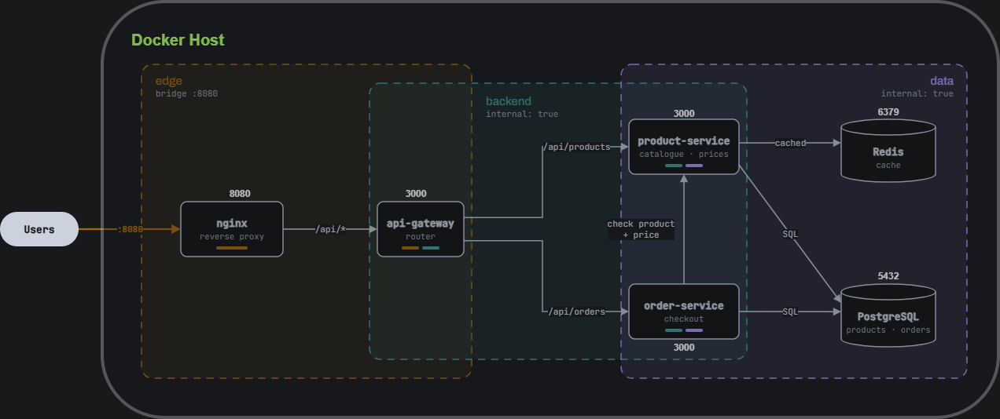
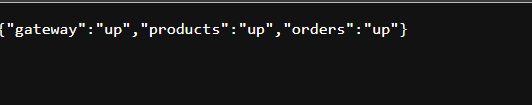
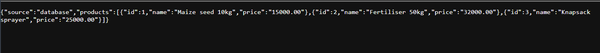
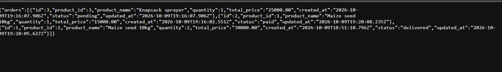
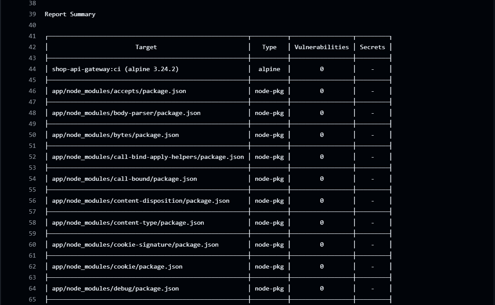
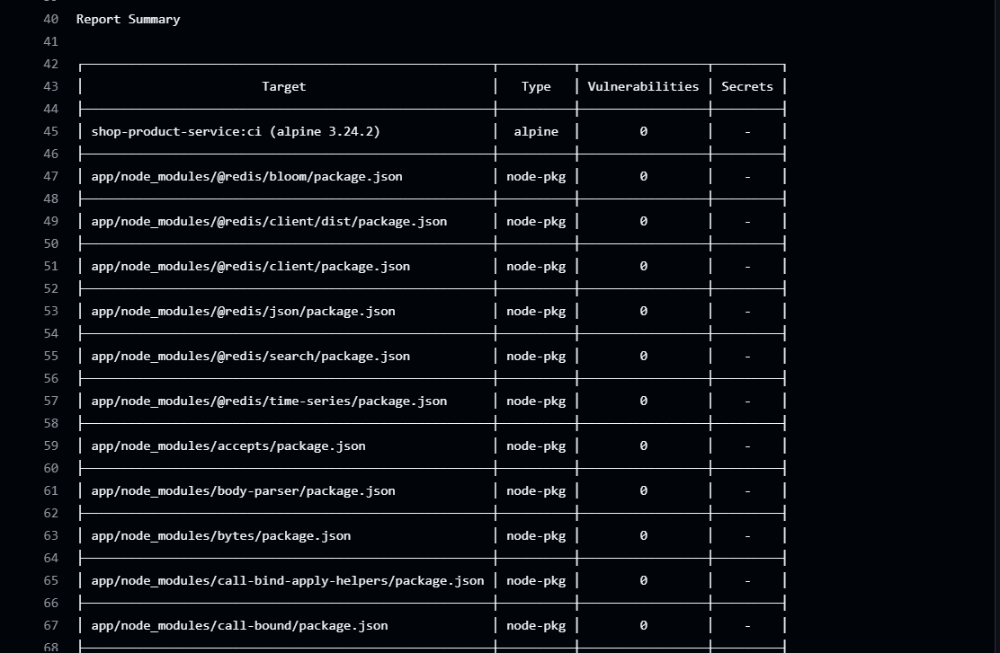
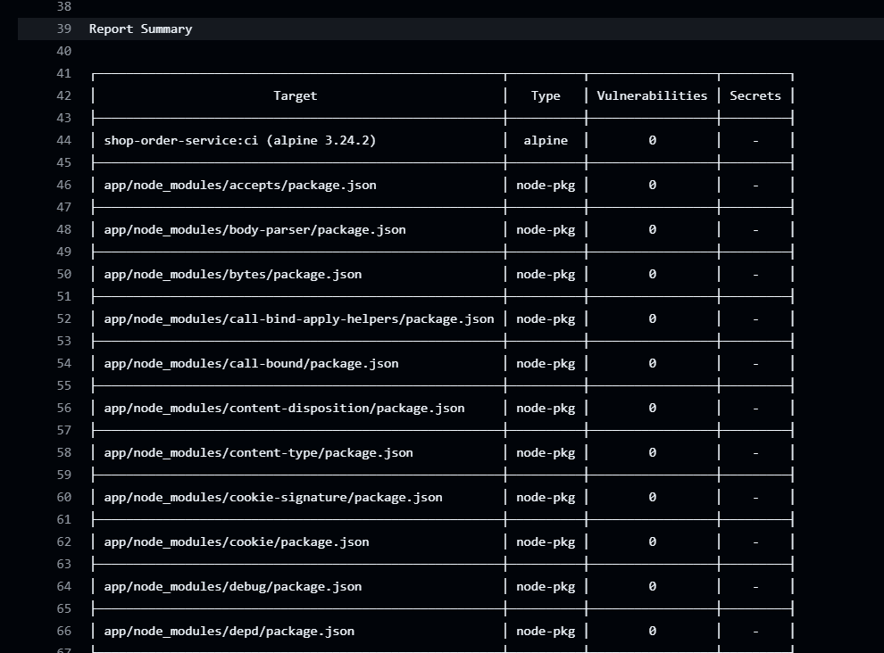

# Microservices-Shop

A Microservice application that uses docker compose to build all the components(three Node.js services, PostgreSQL and Redis behind an nginx reverse proxy)



## Production checklist

| Requirement | Status | How it is met |
|---|---|---|
| Multi-stage builds | ✅ | Node: `build` → `runtime`. nginx: `validate` (`nginx -t`) → `runtime`. |
| Alpine base, pinned versions | ✅ | `alpine:3.24.2`, `nginx-unprivileged:1.31.6-alpine`, `postgres:17.11-alpine3.24`, `redis:8.8.3-alpine`. |
| Non-root | ✅ | Node services as `app`, nginx as `nginx`, postgres as `postgres`, redis as `redis`. |
| HEALTHCHECK | ✅ | Every container. product and order only report healthy when PostgreSQL and Redis respond. |
| Under 150 MB | ✅ | Checked in CI on every build. |
| Layer caching | ✅ | `package*.json` is installed before the source is copied. |
| No secrets in images | ✅ | Passwords come from `.env` at runtime. `.env` is git-ignored and in every `.dockerignore`. |
| Startup order | ✅ | `depends_on: service_healthy`: nginx → gateway → product + order → postgres + redis. |
| Named volumes | ✅ | `pgdata`, `redisdata`. |
| networks | ✅ | `edge`, `backend` (internal), `data` (internal). |
| Resource limits | ✅ | CPU and memory limits on every service. |

## Quick start

```bash
cp .env.example .env                                   # then change the passwords
docker compose up --build --watch                      # dev: hot reload, debug ports 9229-9231
docker compose -f docker-compose.prod.yml up -d --wait # prod: pulls images from Docker Hub
curl localhost:8080/api/status                         # {"gateway":"up","products":"up","orders":"up"}
```

## 1. How the services are isolated

Only nginx publishes a port (`8080`). `backend` and `data` are internal networks with no route to the internet. nginx can reach only the gateway, and only the product and order services can reach PostgreSQL and Redis. The gateway sits on `edge` and `backend`; the two services sit on `backend` and `data`.

## 2. Why the images are small

The Node runtime stage starts from plain `alpine` and installs only the `nodejs` package, so npm never reaches the final image. Using `node:24-alpine` would not do this: npm and yarn are in its base layers, and deleting them later doesn't shrink the image.

| Image | Size |
|---|---|
| shop-api-gateway | 84 MB |
| shop-product-service | 88 MB |
| shop-order-service | 84 MB | 
| shop-nginx | 57 MB |

## 3. How the stack starts in the right order

Each service waits for what it needs to be healthy. Product and Order services only report healthy once PostgreSQL and Redis are also ready, so the gateway never starts with a down backend. On `SIGTERM` each service finishes in-flight requests and closes its connections before exiting.

Once the stack is up, every request goes through nginx on port `8080`.

`/api/status`: the gateway checks that the product and order services are both reachable:



`/api/products`: the first call reads from PostgreSQL, then calls within the next 60 seconds come from Redis.



`POST /api/orders`: order-service asks product-service for the current price, then saves the order with its total:



## 4. How images are tagged and pushed

Images are named `<DOCKERHUB_USERNAME>/shop-<service>:<TAG>`. In CI, pushing a git tag `v1.0.0` publishes `:v1.0.0`, and every push to `main` publishes `:sha-<commit>`. CI needs the repository secrets `DOCKERHUB_USERNAME` and `DOCKERHUB_TOKEN` (an access token, not your password).

## 5. What CI checks

The pipeline should check every image build size, check for non-root user, Trivy scan, which fails on fixable CRITICAL CVEs. Then a smoke test starts the whole stack and calls the API through nginx. Images are pushed only after both pass, and never from pull requests.

Trivy scans both the Alpine packages and every npm package in `node_modules`. All three Node services came back clean, with `0` HIGH or CRITICAL vulnerabilities:





