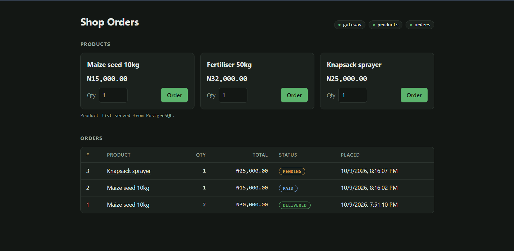

# Microservices-Shop

A Microservice application that uses docker compose to build all the components(three Node.js services, PostgreSQL and Redis behind an nginx reverse proxy)


## Production checklist

| Requirement | How it is met |
|---|---|
| Multi-stage builds | **nginx:** validate stage and runtime stage <br>**api-gateway:** build stage  and runtime stage<br>**product-service:** build stage and runtime stage<br>**order-service:** build stage and runtime stage |
| Alpine base, pinned versions | **nginx:** `nginxinc/nginx-unprivileged:1.31.6-alpine`<br>**api-gateway:** `alpine:3.24.2`<br>**product-service:** `alpine:3.24.2`<br>**order-service:** `alpine:3.24.2`<br>**postgres:** `postgres:17.11-alpine3.24`<br>**redis:** `redis:8.8.3-alpine` |
| Non-root | **nginx:** `nginx`<br>**api-gateway:** `app`<br>**product-service:** `app` <br>**order-service:** `app` <br>**postgres:** `postgres`<br>**redis:** `redis` |
| HEALTHCHECK | **nginx:** `wget /nginx-health`<br>**api-gateway:** `node src/healthcheck.js`<br>**product-service:** `node src/healthcheck.js`, healthy only when PostgreSQL and Redis respond<br>**order-service:** `node src/healthcheck.js`, healthy only when PostgreSQL responds<br>**postgres:** `pg_isready`<br>**redis:** `redis-cli ping` |
| Under 150 MB | **nginx:** 57 MB<br>**api-gateway:** 84 MB<br>**product-service:** 88 MB<br>**order-service:** 84 MB<br>CI fails the build if any image reaches 150 MB. |
| Layer caching | **api-gateway, product-service, order-service:** `package.json` and `package-lock.json` are copied and installed before `src/`, so a code change doesn't reinstall dependencies.<br>**nginx:** only `nginx.conf` and `index.html` are sent to the build. |
| No secrets in images | **api-gateway, product-service, order-service:** `.dockerignore` excludes `.env`, `.npmrc` and key files.<br>**nginx:** `.dockerignore` lets in only `nginx.conf` and `index.html`.<br>**postgres, redis:** passwords are passed from `.env` when the container starts. `.env` is git-ignored. |
| Startup order (`depends_on: service_healthy`) | **nginx:** waits for api-gateway<br>**api-gateway:** waits for product-service and order-service<br>**product-service:** waits for postgres and redis<br>**order-service:** waits for postgres and product-service |
| Named volumes | **postgres:** `pgdata` → `/var/lib/postgresql/data`<br>**redis:** `redisdata` → `/data` |
| Custom networks | **nginx:** `edge`<br>**api-gateway:** `edge`, `backend`<br>**product-service:** `backend`, `data`<br>**order-service:** `backend`, `data`<br>**postgres:** `data`<br>**redis:** `data`<br>`backend` and `data` are internal, with no route to the internet. |
| Resource limits | **nginx:** 0.25 CPU, 64 MB<br>**api-gateway:** 0.50 CPU, 256 MB<br>**product-service:** 0.50 CPU, 256 MB<br>**order-service:** 0.50 CPU, 256 MB<br>**postgres:** 0.50 CPU, 512 MB<br>**redis:** 0.25 CPU, 128 MB |

## Quick start

```bash
cp .env.example .env                                   
docker compose up --build
docker compose -f docker-compose.prod.yml up -d --wait
curl localhost:8080/api/status
```

## 1. How the services are isolated

Only nginx publishes a port (`8080`). `backend` and `data` are internal networks with no route to the internet. nginx can reach only the gateway, and only the product and order services can reach PostgreSQL and Redis. The gateway sits on `edge` and `backend`; the two services sit on `backend` and `data`.

## 2. Why the images are small

The Node runtime stage starts from plain `alpine` and installs only the `nodejs` package, so npm never reaches the final image. Using `node:24-alpine` would not do this: npm and yarn are in its base layers, and deleting them later doesn't shrink the image.

| Image | Size |
|---|---|
| shop-api-gateway | 84 MB |
| shop-product-service | 88 MB |
| shop-order-service | 84 MB | 
| shop-nginx | 57 MB |

## 3. How the stack starts in the right order

Each service waits for what it needs to be healthy. Product and Order services only report healthy once PostgreSQL and Redis are also ready, so the gateway never starts with a down backend. On `SIGTERM` each service finishes in-flight requests and closes its connections before exiting.

Once the stack is up, every request goes through nginx on port `8080`.

`/api/status`: the gateway checks that the product and order services are both reachable:


`/api/products`: the first call reads from PostgreSQL, then calls within the next 60 seconds come from Redis.


`POST /api/orders`: order-service asks product-service for the current price, then saves the order with its total:


The order page at http://localhost:8080 does all of this from the browser. It shows the health of each service, the products (here served from the Redis cache), an **Order** button for each product, and every order with its status:



## 4. How images are tagged and pushed

Images are named `<DOCKERHUB_USERNAME>/shop-<service>:<TAG>`. In CI, pushing a git tag `v1.0.0` publishes `:v1.0.0`, and every push to `main` publishes `:sha-<commit>`. CI needs the repository secrets `DOCKERHUB_USERNAME` and `DOCKERHUB_TOKEN`(personal access token).

## 5. What CI checks

The pipeline should check every image build size, check for non-root user, Trivy scan, which fails on fixable CRITICAL CVEs. Then a smoke test starts the whole stack and calls the API through nginx. Images are pushed only after both pass, and never from pull requests.

Trivy scans both the Alpine packages and every npm package in `node_modules`. All three Node services came back clean, with `0` HIGH or CRITICAL vulnerabilities:

### trivy-api-gateway


### trivy-product-service


### trivy-order-service
